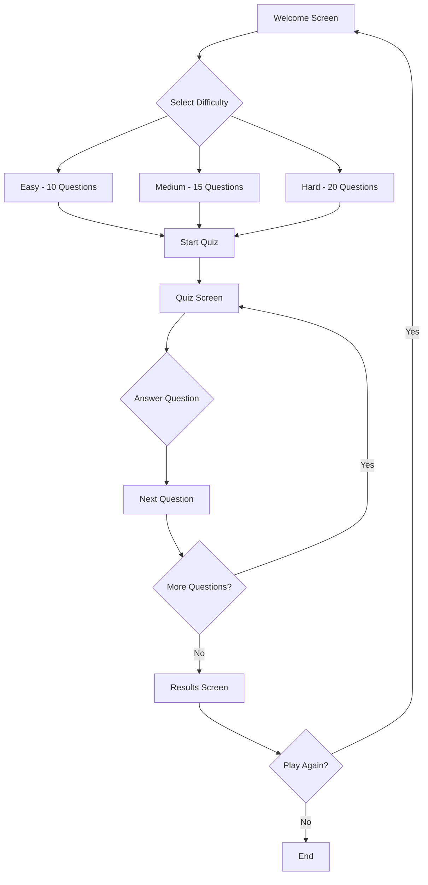
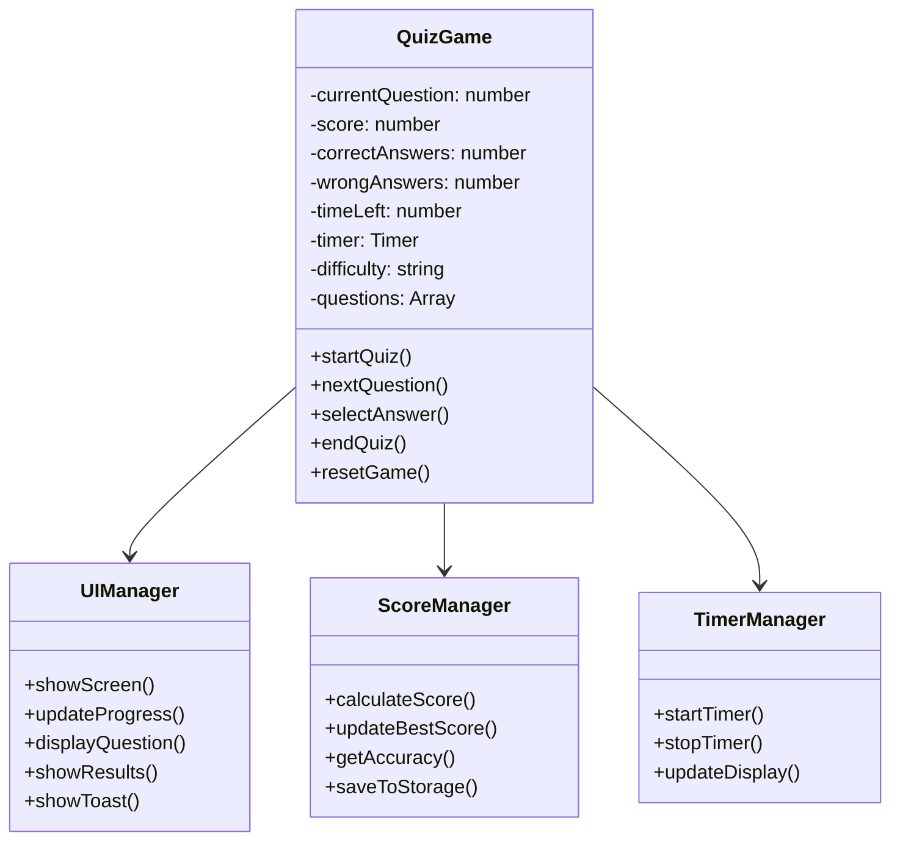
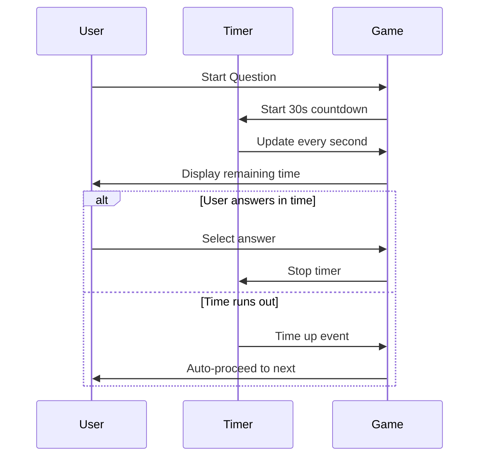

# 🧠 QuizMaster Pro

A modern, interactive web-based quiz game featuring multiple difficulty levels, real-time scoring, and engaging animations. Test your knowledge across various topics with a sleek, responsive interface.


## 🌟 Features

- **🎯 Multiple Difficulty Levels**: Easy (10 questions), Medium (15 questions), Hard (20 questions)
- **⏱️ Timed Questions**: 30-second countdown per question
- **🏆 Real-time Scoring**: Dynamic score calculation with point system
- **📊 Progress Tracking**: Visual progress bar and question counter
- **🎨 Animated UI**: Floating background shapes and smooth transitions
- **📱 Responsive Design**: Works seamlessly on desktop and mobile devices
- **💾 Score Persistence**: Best score saved in local storage
- **📈 Detailed Results**: Comprehensive performance analytics
- **🔄 Replay Functionality**: Easy restart with different difficulty levels
- **📤 Social Sharing**: Share your quiz results

## 🚀 Demo

### Application Flow Diagram



### Screen Flow

```
┌─────────────────┐    ┌─────────────────┐    ┌─────────────────┐
│  Welcome Screen │ -> │   Quiz Screen   │ -> │ Results Screen  │
│                 │    │                 │    │                 │
│ • Difficulty    │    │ • Progress Bar  │    │ • Final Score   │
│ • Start Button  │    │ • Timer         │    │ • Statistics    │
│ • Stats Preview │    │ • Question      │    │ • Share/Replay  │
└─────────────────┘    │ • Options       │    └─────────────────┘
                       │ • Next Button   │
                       └─────────────────┘
```

## 🏗️ Architecture

### Project Structure

```
Quiz-Game/
├── index.html          # Main HTML structure
├── styles.css          # CSS styling and animations
├── script.js           # JavaScript game logic
└── README.md          # Project documentation
```

### Component Architecture



## 🎮 How to Play

1. **Choose Difficulty**: Select from Easy, Medium, or Hard levels
2. **Start Quiz**: Click the "Start Quiz" button to begin
3. **Answer Questions**: Select your answer within the 30-second time limit
4. **Track Progress**: Monitor your progress with the visual progress bar
5. **View Results**: See your final score and detailed statistics
6. **Play Again**: Restart with the same or different difficulty level

### Scoring System

| Difficulty | Points per Question | Total Questions | Max Score |
|------------|-------------------|-----------------|-----------|
| Easy       | 5 points          | 10              | 50        |
| Medium     | 10 points         | 15              | 150       |
| Hard       | 15 points         | 20              | 300       |

## 🛠️ Installation & Setup

### Prerequisites

- Modern web browser (Chrome, Firefox, Safari, Edge)
- No additional dependencies required

### Quick Start

1. **Clone or Download** the repository:
   ```bash
   git clone https://github.com/yourusername/quiz-game.git
   cd quiz-game
   ```

2. **Open in Browser**:
   - Double-click `index.html`, or
   - Use a local server:
     ```bash
     # Using Python
     python -m http.server 8000
     
     # Using Node.js
     npx serve .
     
     # Using PHP
     php -S localhost:8000
     ```

3. **Start Playing**: Navigate to `http://localhost:8000` (if using a server) or open the file directly

## 🎨 Customization

### Adding New Questions

Edit the `generateQuestions()` method in `script.js`:

```javascript
// Add to the appropriate difficulty level
easy: [
    {
        question: "Your question here?",
        options: ["Option 1", "Option 2", "Option 3", "Option 4"],
        correct: 0, // Index of correct answer (0-3)
        points: 5
    }
    // ... more questions
]
```

### Modifying Difficulty Settings

Update the difficulty configuration:

```javascript
const difficultyConfig = {
    easy: { questions: 10, timePerQuestion: 30, pointsPerQuestion: 5 },
    medium: { questions: 15, timePerQuestion: 30, pointsPerQuestion: 10 },
    hard: { questions: 20, timePerQuestion: 30, pointsPerQuestion: 15 }
};
```

### Styling Customization

Key CSS variables for easy theming:

```css
:root {
    --primary-gradient: linear-gradient(135deg, #667eea 0%, #764ba2 100%);
    --accent-color: #ffe66d;
    --success-color: #4caf50;
    --error-color: #f44336;
    --text-color: #333;
    --background-blur: blur(10px);
}
```

## 📱 Responsive Design

The application is fully responsive and adapts to different screen sizes:

- **Desktop**: Full-featured experience with hover effects
- **Tablet**: Optimized layout for touch interaction
- **Mobile**: Compact design with touch-friendly buttons

### Breakpoints

```css
/* Mobile First Approach */
@media (max-width: 768px) { /* Mobile styles */ }
@media (min-width: 769px) and (max-width: 1024px) { /* Tablet styles */ }
@media (min-width: 1025px) { /* Desktop styles */ }
```

## 🔧 Technical Details

### Technologies Used

- **HTML5**: Semantic markup and structure
- **CSS3**: Modern styling with flexbox, grid, and animations
- **Vanilla JavaScript**: ES6+ features, no external dependencies
- **Local Storage**: Score persistence
- **CSS Animations**: Smooth transitions and floating elements

### Browser Compatibility

| Browser | Version | Support |
|---------|---------|---------|
| Chrome  | 60+     | ✅ Full |
| Firefox | 55+     | ✅ Full |
| Safari  | 12+     | ✅ Full |
| Edge    | 79+     | ✅ Full |

### Performance Features

- **Lazy Loading**: Questions generated on demand
- **Efficient DOM Manipulation**: Minimal reflows and repaints
- **CSS Animations**: Hardware-accelerated transforms
- **Local Storage**: Fast score retrieval

## 🎯 Game Mechanics

### Question Categories

The quiz includes questions from various categories:

- **Easy**: General knowledge, basic math, simple facts
- **Medium**: Science, history, geography, literature
- **Hard**: Advanced topics, programming, physics, complex concepts

### Timer System



### Scoring Algorithm

```javascript
function calculateScore(isCorrect, timeLeft, difficulty) {
    if (!isCorrect) return 0;
    
    const basePoints = difficultyPoints[difficulty];
    const timeBonus = Math.floor(timeLeft / 30 * basePoints * 0.1);
    
    return basePoints + timeBonus;
}
```

## 🚀 Future Enhancements

### Planned Features

- [ ] **Multiplayer Mode**: Real-time competition with friends
- [ ] **Question Categories**: Filter by specific topics
- [ ] **Leaderboards**: Global and local high scores
- [ ] **Sound Effects**: Audio feedback for interactions
- [ ] **Achievements**: Unlock badges for milestones
- [ ] **Custom Quizzes**: User-generated content
- [ ] **Analytics**: Detailed performance tracking
- [ ] **Offline Mode**: Play without internet connection

### API Integration Ideas

- [ ] **Trivia API**: Dynamic question fetching
- [ ] **User Authentication**: Save progress across devices
- [ ] **Social Features**: Share and compare scores
- [ ] **Content Management**: Admin panel for questions

## 🤝 Contributing

We welcome contributions! Here's how you can help:

1. **Fork** the repository
2. **Create** a feature branch (`git checkout -b feature/AmazingFeature`)
3. **Commit** your changes (`git commit -m 'Add some AmazingFeature'`)
4. **Push** to the branch (`git push origin feature/AmazingFeature`)
5. **Open** a Pull Request

### Contribution Guidelines

- Follow existing code style and conventions
- Add comments for complex logic
- Test your changes across different browsers
- Update documentation for new features
- Ensure responsive design compatibility

## 📄 License

This project is licensed under the MIT License - see the [LICENSE](LICENSE) file for details.

## 🙏 Acknowledgments

- **Font Awesome** for the beautiful icons
- **Google Fonts** for typography
- **CSS Gradient** inspiration from various design resources
- **Community** feedback and suggestions

## 📞 Support

If you encounter any issues or have questions:

1. **Check** the [Issues](https://github.com/sahoo-tech/quiz-game/issues) page
2. **Create** a new issue with detailed description
3. **Contact** the maintainers

---

<div align="center">

**Made with ❤️ by Sayantan Sahoo**

[⭐ Star this repo](https://github.com/yourusername/quiz-game) | [🐛 Report Bug](https://github.com/yourusername/quiz-game/issues) | [✨ Request Feature](https://github.com/yourusername/quiz-game/issues)


</div>
